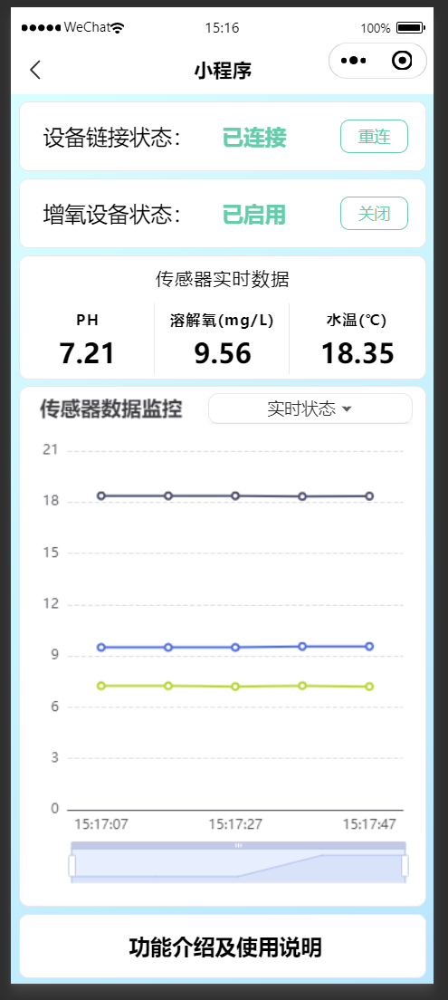
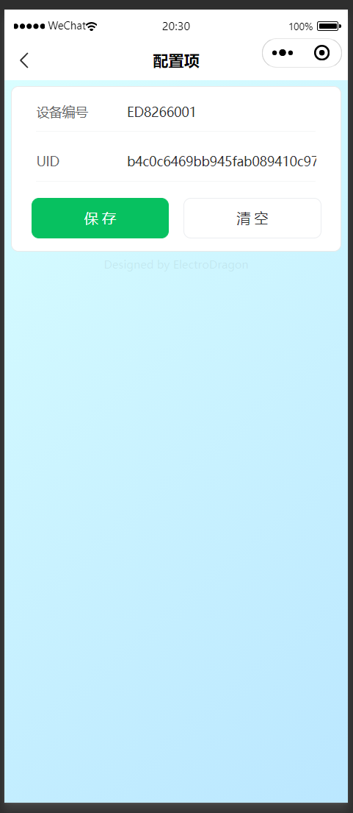

## Introduction

A WeChat Mini Program for monitoring water quality and controlling oxygenation devices in aquaculture systems.

This Mini Program was created form scratch in two months. It still has imperfections and lacks full standardization , but I hope it can offer useful insights or inspirations for anyone working on similar projects.

**PS:** This Mini Program depends on external hardware (sensors, ESP8266,Mega 2560). It cannot work as a close-loop system without those devices. Besides, I don't want it can be easily duplicated by my competitors, so I wrote down this document in English.

## Screenshots

<div style="display: flex; overflow-x: auto; gap: 3px;">
  
  
  
  
</div>

## Features

- Real-time monitoring of PH / DO (Dissolved Oxygen) / Water Temperature
- Remote control of oxygenation devices
- MQTT-based device communication
- Historical / Realtime data charting

## Tech Stack

- Vant Weapp - UI components
- Echarts for WeChat - Data visualization
- mqtt.min.js - MQTT client
- marked.min.js - Markdown rendering

## Install & Build

1. Clone the repository or download the code

2. Install the dependencies

   ```
   npm install
   ```

3. Open the project in WeChat Developer Tools

4. Build NPM and compile the project

5. Log in to the [WeChat Mini Program Console](https://mp.weixin.qq.com/), 

   1. Navigate to Development > Development Management
   2. Add following Domains:

   ```
   Request Legal Domains: https://api.bemfa.com;
   Socket Legal Domains: wss://bemfa.com:9504
   ```

   

## How to Use

0. Create an account on [Bemfa.com](https://cloud.bemfa.com/).
1. Create two device at **MQTT Device Cloud** named `yourDeviceName` and `yourDeviceNameCTRL`, remember CTRL is necessary.

2. Open the Mini Program and pull down  to access **"Settings"**.

3. Enter the correct device ID and UID (you can get it from **MQTT Device Cloud**)
4. Tap **Save**. These values will be saved automatically.
5. Exit **Settings**, return to the homepage, and tap **Connect** to link the device.
6. Once the device status shows **Connected**, and if all settings are correct and the device is powered on, the data will be updated automatically.
7. If necessary, click the **Enable** button to start the oxygenation device.

## License

MIT License. See LICENSE for details.